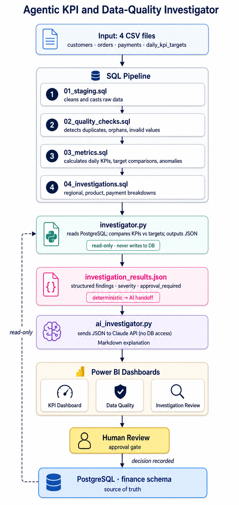

# Agentic KPI and Data-Quality Investigator

SQL-first finance analytics pipeline that detects KPI shortfalls and data-quality issues, then routes findings through Claude for human-review-gated investigation reports.

**Stack:** DuckDB · PostgreSQL · Python · Claude API · Power BI



---

## Architecture

```
CSV raw data (customers, orders, payments, targets)
        ↓
SQL pipeline  01_staging → 02_quality → 03_metrics → 04_investigations
        ↓
Deterministic investigator  (read-only, outputs JSON findings)
        ↓
Claude API explanation layer  (no DB access, approval_required on every finding)
        ↓
Power BI dashboards + human review
```

---

## Business questions answered

- What was daily net revenue and payment-success rate?
- Which KPIs missed target, and by how much?
- Are there duplicate or unmatched records?
- Which regions and products explain a revenue change?
- Which days require investigation?

Business logic lives in `sql/`; Python only orchestrates data loading and pipeline execution.

---

## Key findings (sample output)

| Date | Net Revenue | Target | Gap | Payment Success | Severity |
|---|---:|---:|---:|---:|---|
| 2026-01-05 | $5,743.58 | $5,755.25 | -$11.67 | 64.29% | medium |
| 2026-01-09 | $4,697.16 | $4,916.50 | -$219.34 | 73.33% | medium |
| 2026-01-10 | $6,162.68 | $6,504.88 | -$342.20 | 78.57% | medium |
| 2026-08-17 | $100.00 | — | — | 0.00% | **high** |

`O9999` (2026-08-17): revenue recorded with 0% payment success and no target — internally inconsistent, flagged for human review before any action.

---

## Run (DuckDB — local dev)

```powershell
pip install -r requirements.txt
python src/generate_data.py
python src/run_pipeline.py
```

Creates `data/processed/finance.duckdb` with staging, quality, KPI, anomaly, and investigation tables.

## Run (PostgreSQL — production)

```powershell
psql -h 127.0.0.1 -U postgres -d postgres -f sql/postgres_schema.sql
python -m pip install "psycopg[binary]"
python src/postgres_pipeline.py
```

The first command creates the `finance` schema, tables, and views — required once
per database before `postgres_pipeline.py` will run. Set `DATABASE_URL` if your
connection details differ from the local default in `src/postgres_pipeline.py`.

Upserts the four CSV inputs, records each run in `finance.pipeline_runs`, exports KPI and quality CSVs to `data/exports/`.

## Run investigation + AI explanation

```powershell
python src/investigator.py
$env:ANTHROPIC_API_KEY = "YOUR_KEY"
python src/ai_investigator.py
```

Outputs `data/exports/investigation_results.json` and `data/exports/ai_investigation.md`.

---

## Design decisions

- **SQL-first**: all business logic in `sql/`; Python is orchestration only
- **Read-only investigation**: investigator never writes to financial records; output marked `"read_only": true`
- **Human approval gate**: every AI finding carries `approval_required: yes`; decisions recorded in `finance.investigation_reviews`
- **Dual DB**: DuckDB for local dev, PostgreSQL for production — same SQL logic
